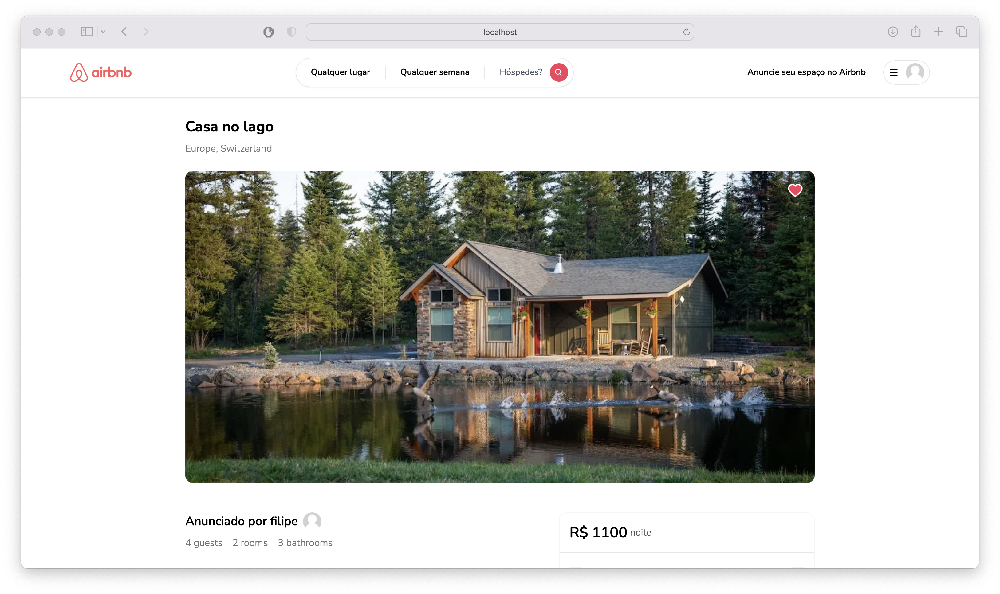
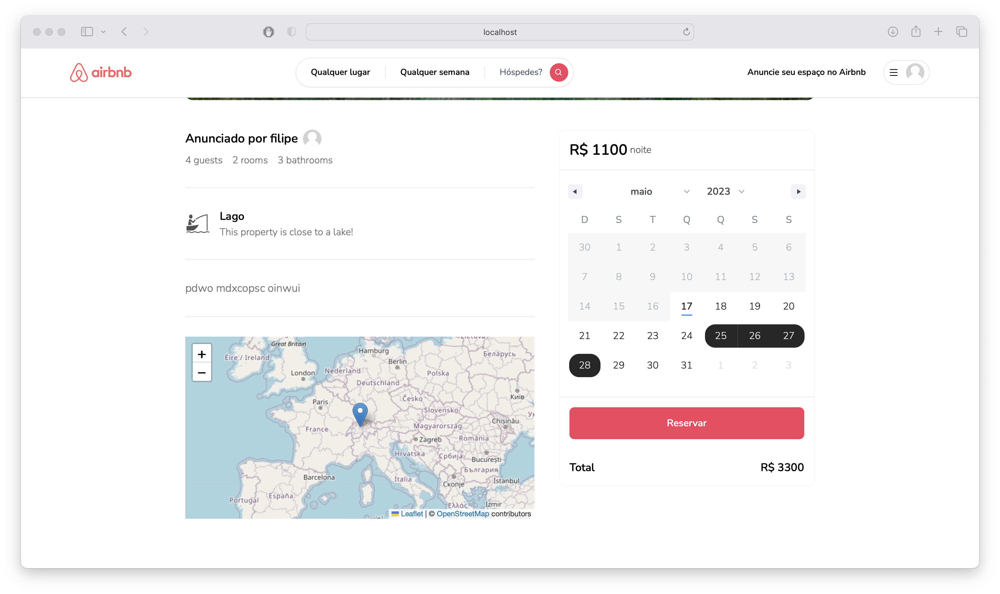
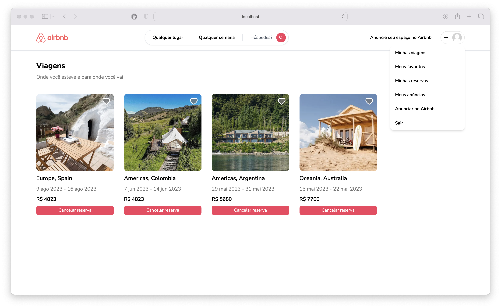
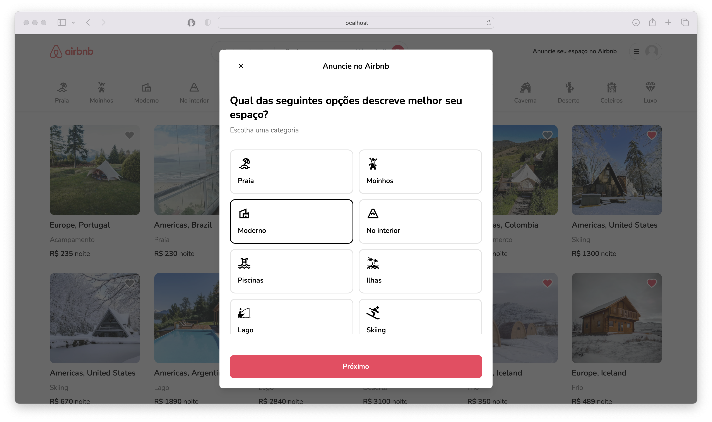

<div align="center">
  
</div>

<hr/>

<h6 align="center">Esse projeto clone do Airbnb, o programa se trata de uma aplicação fullstack com typescript.</h6>


<h3>Tecnologias:</h3>
<ul>
  <li>NextJS</li>
  <li>ReactJs</li>
  <li>TailwindCss</li>
  <li>Prisma</li>
  <li>Next-Auth</li>
  <li>Typescript</li>
</ul>

<div align="center">
  
  
</div>

<h3>Como rodar:</h3>

```
Faça o clone do projeto
$ git clone https://github.com/FilipeDiasLima/airbnb.git
```

```
Entre no diretório do projeto e instale as dependências
$ cd airbnb
$ yarn
```

```
Execute o prisma
$ yarn prisma db push
```

```
Execute o projeto
$ yarn dev
```

<h3>Sobre o projeto:</h3>
<p>
  O projeto foi desenvolvido a partir de uma 
  <a href="https://www.youtube.com/watch?v=c_-b_isI4vg">vídeo aula do canal Code with Antonio</a> 
  no Youtube, nele é ensinado a nova forma de produção com Next 13, versão que mudou muita coisa no conceito 
  de frontend. Também é ensinado como usar o Next Auth para autenticação dentro do frontend, tanto por formulário 
  quanto por outras redes, como Google e Github. Usamos o Prisma como um construtor de banco de dados. A propria API 
  que a plataforma usa foi feita dentro do NextJs.
</p>

<div align="center">
  
  
   
  
</div>
